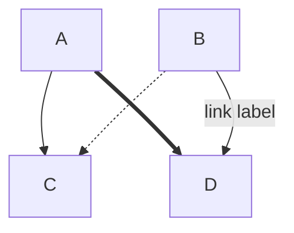
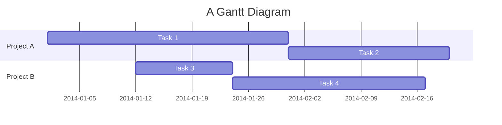
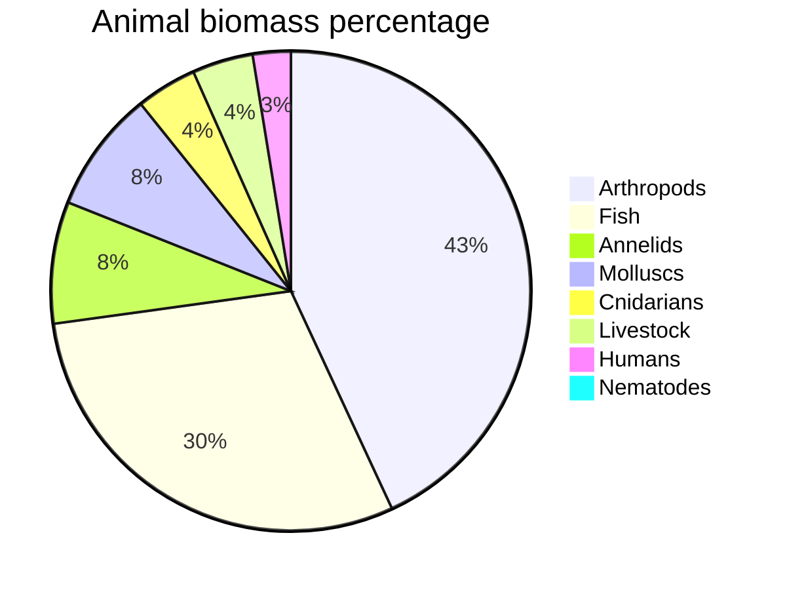
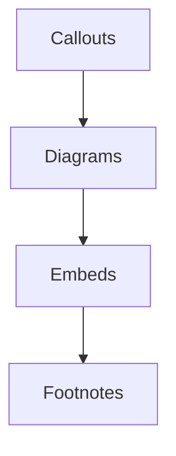

User documentation: https://help.obsidian.md/Editing+and+formatting/Advanced+formatting+syntax#Diagram

Obsidian supports diagrams using [Mermaid](https://mermaid-js.github.io/) syntax. Mermaid supports many diagram types, with just a few examples shown here.
## Diagram types
### Flow chart

### Gantt chart

### Pie chart

## Links in diagrams
Mermaid diagrams can include links to other notes.

